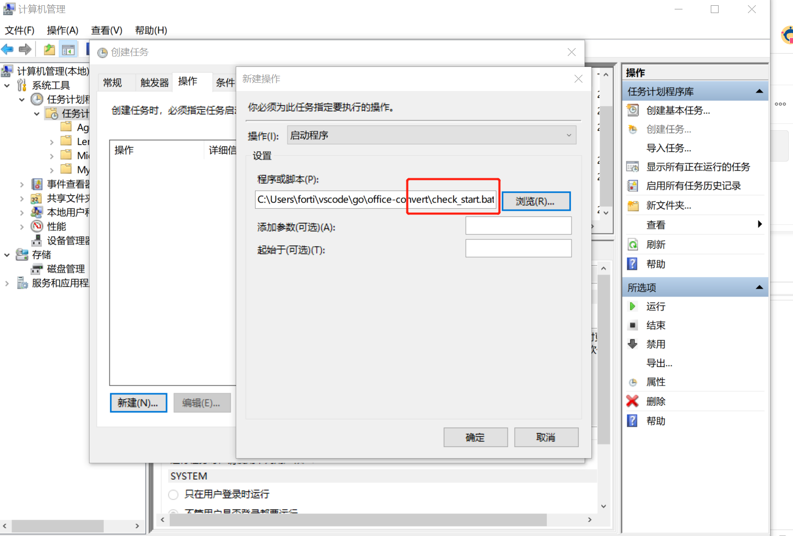

**从doc/docx/xls/xlsx/ppt/pptx转换为pdf**

## 原理
此为使用Windows COM (Component Object Model)方法调用Office相关应用，导出PDF的方法
基本思路就是：调用COM组件，然后模拟 打开/导出/关闭过程

## 编译 （可跳过）
如果要编译源码，得到exe文件，可以执行命令`go build -ldflags "-H windowsgui"` 生成 `office-convert.exe` 
## 运行

### 普通运行 
- 双击执行 `office-convert.exe` 即可,但是如果程序报错，或者电脑异常关机，不会重启

### 后台运行（定时任务启动，可以自动恢复）

- **1、复制文件** 

将`prebuilt`下两个文件复制到 `C:\Users\Administrator\OfficeConvert\` 目录下

- **2、修改COM访问权限**

当我们以服务、定时任务启动程序的时候，会报错，提示空指针错误。
原因就是微软`限制`了COM组件在`非UI Session`的情况下使用（防止恶意病毒之类），如果要允许，需要做如下处理：
[参考这里](https://superuser.com/questions/579900/why-cant-excel-open-a-file-when-run-from-task-scheduler)

- Open Component Services (Start -> Run, type in dcomcnfg)
- Drill down to Component Services -> Computers -> My Computer and click on DCOM Config
- Right-click on Microsoft Excel Application and choose Properties
- In the Identity tab select This User and enter the ID and password of an interactive user account (domain or local) and click Ok


注意，上图是演示，账号密码填写该机器的`Administrator`账号密码

- **3、定时任务**

 创建windows定时任务，每1分钟调用`check_start.bat`文件，该文件自动检查`office-convert.exe`是否运行，没有就启动。

 
 
 **注意： 上图只是演示，具体位置填写 `C:\Users\Administrator\OfficeConvert\check_start.bat`**

 

### Web部署/请求/响应

#### 部署

使用nginx作为反向代理，具体位置在 `C:\Users\Administrator\nginx-1.20.2\nginx-1.20.2`下，修改`conf/nginx.conf`文件，代理127.0.0.1:10000即可，
有公网IP(比如xxx.com)的话，配置DNS解析`convert-tools.xxx.com`到此机器ip。

```conf
server {
        listen       80;
        server_name  convert-tools.xxx.net;

        #charset koi8-r;

        #access_log  logs/host.access.log  main;

        location / {
            root   html;
            index  index.html index.htm;
            proxy_pass http://127.0.0.1:10000;
        }
        # ...其他设置
}
```


#### 请求
已部署到Windows机器，访问URL:
http://127.0.0.1:10000 (如果上面配置了域名，则访问 http://convert-tools.xxx.com/convert)


请求相关

Method :   POST

Content-Type: application/json

Body: 
```json
{
    "file_in_url":"https://your_docx_file_url",
    "source_type":"docx",
    "target_type":"pdf"
}
```

|参数|是否必须|取值范围|说明|
|--|--|--|--|
|file_in_url|是|满足下面source_type的各类文档url|待转换的文档的网络连接|
|source_type|是|[doc,docx,xls,xlsx,ppt,pptx]|文档类型|
|target_type|是|pdf|暂时只支持PDF，后续会支持更多|

#### 响应
根据HTTP状态码做判断

200 : ok
其他: 有错


Body:
转换的文件的二进制流

如果status_code非200，是对应的报错信息